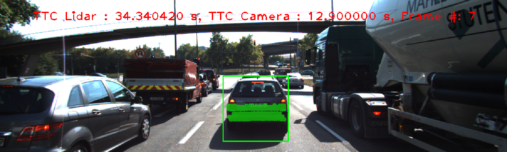
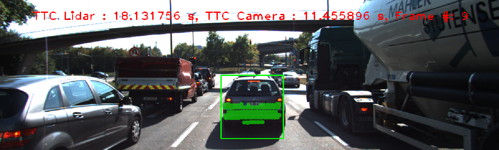
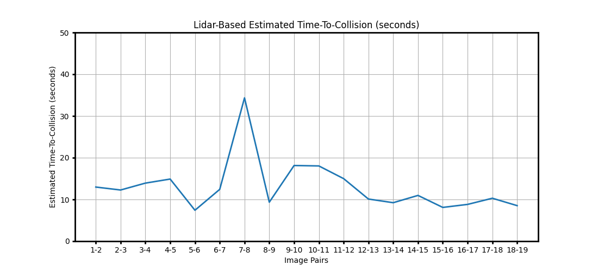
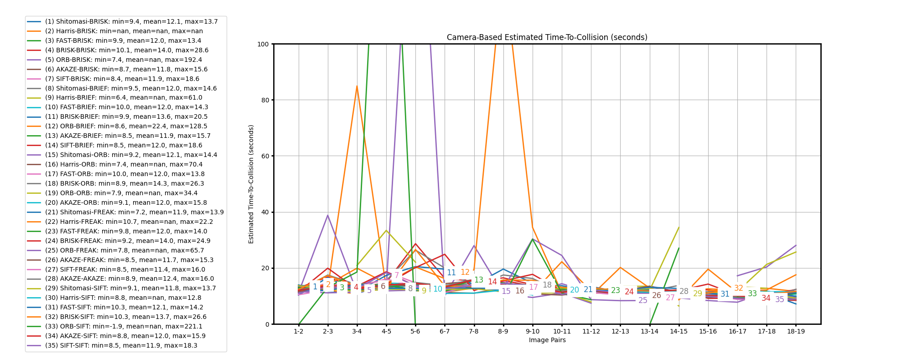
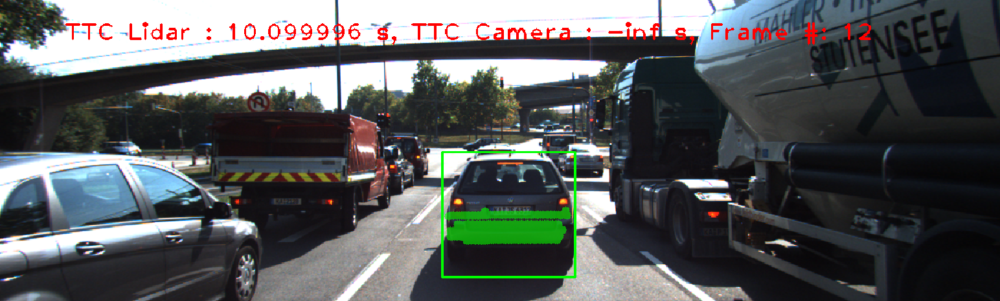
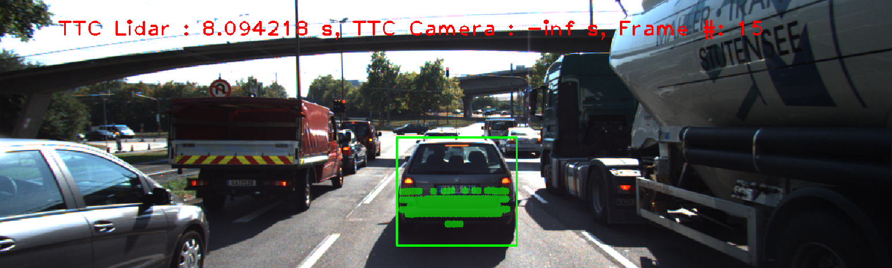

# SFND 3D Object Tracking


This projects implements a Time-to-Collision (TTC) processing pipeline that would be part of a collision avoidance system on a self-driving vehicle. It makes TTC estimates based on measurements from Lidar and Radar sensors. This pipeline implements the following:
- OpenCV keypoint detectors/descriptors
- Object detection using a pre-trained YOLO DNN on COCO dataset (training included images of vehicles) 
- Methods to track objects of interest by matching keypoints and corresponding bounding boxes across successive images
- Associating regions in a camera image with lidar points in 3D space

The flowchart illustrates the TTC processing pipeline. Blocks in the orange rectangle include reading images from an Point Grey Flea 2 camera, detecting, extracting, and matching relevant keypoints. In the blue box and downstream, Lidar points are cropped and clustered, while objects detected with the YOLO deep neural network from the camera are matched the corrsponding lidar point cloud. These clusters of lidar points and keypoints are tracked across frames by considering the strength of keypoint correspondences within their bounding boxes. Finally, a statistically robust estimation of the TTC is performed with data from both the lidar and camera sensors.


## Dependencies
* cmake >= 2.8
  * All OSes: [click here for installation instructions](https://cmake.org/install/)
* make >= 4.1 (Linux, Mac), 3.81 (Windows)
  * Linux: make is installed by default on most Linux distros
  * Mac: [install Xcode command line tools to get make](https://developer.apple.com/xcode/features/)
  * Windows: [Click here for installation instructions](http://gnuwin32.sourceforge.net/packages/make.htm)
* Git LFS
  * Weight files are handled using [LFS](https://git-lfs.github.com/)
  * `brew install git-lfs  # Install for macOS, see link above for others`
  * `git remote add https://github.com/udacity/SFND_3D_Object_Tracking.git`
  * `git lfs install`
  * `git lfs pull upstream`
* OpenCV >= 4.1
  * This must be compiled from source using the `-D OPENCV_ENABLE_NONFREE=ON` cmake flag for testing the SIFT and SURF detectors.
  * The OpenCV 4.1.0 source code can be found [here](https://github.com/opencv/opencv/tree/4.1.0)
* gcc/g++ >= 5.4
  * Linux: gcc / g++ is installed by default on most Linux distros
  * Mac: same deal as make - [install Xcode command line tools](https://developer.apple.com/xcode/features/)
  * Windows: recommend using [MinGW](http://www.mingw.org/)

## Building and running the project
```
mkdir build && cd build
cmake ..
make
./3D_object_tracking
```

## Implementation Write-up

### Matching 3D objects
_Lines 301-367 in camFusion.cpp_  
The `matchBoundingBoxes` method , which takes as input both the previous and the current data frames and provides as the output the ids of the matched regions of interest (i.e. the boxID property), is implemented where each bounding box is assigned the match candidate with the highest number of occurences. See function definition below for implementation details. 
```cpp
void matchBoundingBoxes(std::vector<cv::DMatch> &matches, std::map<int, int> &bbBestMatches, DataFrame &prevFrame, DataFrame &currFrame)
{
    std::multimap<int, int> bbox_matches;
    cv::KeyPoint prevKP;
    cv::KeyPoint currKP;
        
    // loop over all matches
    for(auto it=matches.begin();it!=matches.end();it++)
    {
        // get position of matches from each image
        // train is prevFrame and query is currFrame
        // everything is in the Dataframe
        prevKP = prevFrame.keypoints[it->queryIdx];
        currKP = currFrame.keypoints[it->trainIdx];


        // find out which bboxes in previous frame and current frame contain the match
        for(auto prev_it=prevFrame.boundingBoxes.begin();prev_it!=prevFrame.boundingBoxes.end();prev_it++)
        {
            // add these bbox ids to a multimap where matchIdx is the key and the values are bbox ids
            if(prev_it->roi.contains(prevKP.pt))
            {
                // now see which current frame bounding box this point is in
                for(auto curr_it=currFrame.boundingBoxes.begin();curr_it!=currFrame.boundingBoxes.end();curr_it++)
                {
                    if(curr_it->roi.contains(currKP.pt))
                    {
                        bbox_matches.insert(std::pair<int,int>(prev_it->boxID, curr_it->boxID));
                    }
                }
            }
        }
    }

    // loop over multimap and count all matches that have the same bbox id in previous frame, then
    // the current bbox that has the most matches is associated with that previous bbox
    std::unordered_map<int,int> counts;
    int max_count, res;
    typedef std::multimap<int,int>::iterator MMAPIterator;
    std::pair<MMAPIterator, MMAPIterator> result;
    
    for(auto it=bbox_matches.begin(); it!=bbox_matches.end(); it++)
    {
        // find mode for each key
        result = bbox_matches.equal_range(it->first);
        for(MMAPIterator mit = result.first; mit!= result.second; mit++)
        {
            counts[mit->second]++;
        }
        // now that I have counts, I pick one with most elements
        max_count = 0; res = -1;
        for(auto i: counts)
        {
            if(max_count < i.second)
            {
                res = i.first;
                max_count = i.second;
            }
        }
        // res is the current bbox id for given prev bbox id
        if(res != -1)
        {
            bbBestMatches[it->first]=res;
        }
        counts.clear();
    }
}
```

### Computing lidar-based TTC
_Lines 286-298 in camFusion.cpp_  
The time-to-collision (TTC) in seconds for all matched 3D objects using only Lidar measurements from the matched bounding boxes between the current and previous frame is computed. Outliers are removed using the InterQuartile Range (IQR) algorithm. Points that lie too far from the median of the lower quartile are not considered when computing TTC.
```cpp
void computeTTCLidar(std::vector<LidarPoint> &lidarPointsPrev,
                     std::vector<LidarPoint> &lidarPointsCurr, double frameRate, double &TTC)
{
    // At this point, we've already got Lidar points associated with a single bounding box in previous and current frame

    // USE IQR to remove outliers for each LidarPoint vector
    // Use smallest X values from previous and current 3D bounding box 
    double prev_X = min_x_lidar_inlier(lidarPointsPrev);
    double curr_X = min_x_lidar_inlier(lidarPointsCurr);

    // Assume constant velocity model
    TTC = prev_X * (1.0/frameRate) / (prev_X-curr_X);
}
```

_Lines 233-284 in camFusion.cpp_  
To calculate minimum inlier points I implemented the function below.
```cpp
double min_x_lidar_inlier(std::vector<LidarPoint> &lidarPoints)
{
    std::vector<double> x_values;
    for(int i=0;i<lidarPoints.size();i++)
    {
        x_values.push_back(lidarPoints[i].x);
    }
    std::sort(x_values.begin(),x_values.end());

    // Q1 = median of n smallest entries
    // Q3 = median of n largest entries
    // IQR = Q3 - Q1
    // if x_i < Q1 - 1.5*IQR, then it's an outlier
    double median, Q1, Q3, IQR, k, lower_bound;
    int n;
    k = 1.5;

    if(x_values.size() % 2 == 0)
    {
        median = (x_values[x_values.size()/2] + x_values[x_values.size()/2-1]) / 2.0; 
        n = x_values.size()/2;
    }
    else
    {
        median = x_values[x_values.size()/2];
        n = (x_values.size() - 1) / 2;
    }

    if(n % 2 == 0)
    {
        Q1 = (x_values[n/2] + x_values[n/2-1]) / 2.0;
        Q3 = (x_values[x_values.size()-n+n/2] + x_values[x_values.size()-n+n/2-1]) / 2.0; 
    }
    else
    {
        Q1 = x_values[n/2];
        Q3 = x_values[x_values.size()-n+n/2];
    }

    IQR = Q3 - Q1;
    lower_bound = Q1 - k*IQR;

    for(auto it=x_values.begin();it!=x_values.end();it++)
    {
        if(*it < lower_bound){
            x_values.erase(it);
            it--;
        }
    }
    // Returns smallest inlier x value
    return x_values[0];
}
```

### Associating Keypoint Correspondences with Bounding Boxes
_Lines 137-167 in camFusion.cpp_  
The function `clusterKptMatchesWithROI` prepares the TTC computation based on camera measurements by associating keypoint correspondences to bounding boxes which enclose them. All the matches that sastisfy this condition are added to vector in the respective bounding boxes only after outliers have been removed based on the euclidean distance between them in relation to all the matches in the bounding box.
```cpp
void clusterKptMatchesWithROI(BoundingBox &boundingBox, std::vector<cv::KeyPoint> &kptsPrev, std::vector<cv::KeyPoint> &kptsCurr, std::vector<cv::DMatch> &kptMatches)
{
    // Associate the given bounding box with all keypoint matches whose Curr keypoint is within the ROI
    // Calculate euclidean distance between the curernt and previous keypoint for each match
    std::vector<cv::DMatch> kptMatches_roi;
    for(auto it=kptMatches.begin();it!=kptMatches.end();it++)
    {
        cv::KeyPoint kpCurr = kptsCurr.at(it->trainIdx);
        if(boundingBox.roi.contains(kpCurr.pt))
        {
            kptMatches_roi.push_back(*it);

        }

    }
    double avg = 0.0;
    for(cv::DMatch kpt : kptMatches_roi)
    {
        avg += kpt.distance;
    }
    avg /= kptMatches_roi.size();

    // Remove all matches where the distance between the current and previous is too large compared to average
    for(auto it=kptMatches_roi.begin();it!=kptMatches_roi.end();it++)
    {
        if(it->distance < avg * 0.7)
        {
            boundingBox.kptMatches.push_back(*it);
        }
    }
}
```

### Computing Camera-based TTC
_Lines 171-225 in camFusion.cpp_  
The time-to-collision in seconds for all matched 3D objects using only keypoint correspondences from the matching bounding boxes between the current and previous frame is computed in function `computeTTCCamera`. Instead of using the mean to compute TTC, the median is used and is therefore less affected by outliers.
```cpp
void computeTTCCamera(std::vector<cv::KeyPoint> &kptsPrev, std::vector<cv::KeyPoint> &kptsCurr, 
                      std::vector<cv::DMatch> kptMatches, double frameRate, double &TTC, cv::Mat *visImg)
{
    // compute distance ratios between all matched keypoints
    vector<double> distRatios; // stores the distance ratios for all keypoints between curr. and prev. frame
    for (auto it1 = kptMatches.begin(); it1 != kptMatches.end() - 1; ++it1)
    { // outer kpt. loop

        // get current keypoint and its matched partner in the prev. frame
        cv::KeyPoint kpOuterCurr = kptsCurr.at(it1->trainIdx);
        cv::KeyPoint kpOuterPrev = kptsPrev.at(it1->queryIdx);

        for (auto it2 = kptMatches.begin() + 1; it2 != kptMatches.end(); ++it2)
        { // inner kpt.-loop

            double minDist = 100.0; // min. required distance

            // get next keypoint and its matched partner in the prev. frame
            cv::KeyPoint kpInnerCurr = kptsCurr.at(it2->trainIdx);
            cv::KeyPoint kpInnerPrev = kptsPrev.at(it2->queryIdx);

            // compute distances and distance ratios
            double distCurr = cv::norm(kpOuterCurr.pt - kpInnerCurr.pt);
            double distPrev = cv::norm(kpOuterPrev.pt - kpInnerPrev.pt);

            if (distPrev > std::numeric_limits<double>::epsilon() && distCurr >= minDist)
            { // avoid division by zero

                double distRatio = distCurr / distPrev;
                distRatios.push_back(distRatio);
            }
        } // eof inner loop over all matched kpts
    }     // eof outer loop over all matched kpts

    // only continue if list of distance ratios is not empty
    if (distRatios.size() == 0)
    {
        TTC = NAN;
        return;
    }

    // compute camera-based TTC from distance ratios
    std::sort(distRatios.begin(), distRatios.end());

    double medianDistRatio;
    if(distRatios.size() % 2 == 0)
    {
        medianDistRatio = 0.5*(distRatios[int(distRatios.size()/2)] + distRatios[int(distRatios.size()/2)-1]);
    }
    else
    {
        medianDistRatio = distRatios[int(distRatios.size()/2)];
    }
    TTC = -(1.0/frameRate) / (1 - medianDistRatio);
}
```

### Performance Evaluation, Lidar Outliers
TTC estimates from Lidar sensor measurements are determined based on estimating the distance from the ego vehicle to the rear of the preceding vehicle. The images below show a camera view of the projected lidar points directly in front of, and closest to the ego vehicle. These illustrate a couple of examples of where the TTC of the Lidar sensor do not seem plausible. In each image below, there is at least one point that is not picked up in the previous frame, and is relatively farther from the ego car than the preceding vehicle actually is. I believe these points are why TTC from the Lidar sensor in these cases are larger than expected. Lidar TTC estimates are recorded in [FP5.csv](FP5.csv).

IMAGE               | Analysis
--------------------| -------------------
 | TTC from Lidar is larger than expected due to outliers and nearly 10% fewer lidar points detected in the current frame compared to the previous frame.
 | TTC from Lidar is larger than expected due to outliers and a different set of lidar points being measured on the same region (left edge) of the preceding vehicle in the current frame compared to the previous frame. 


### Performance Evaluation, Detector/Descriptor combinations
All detector/descriptor combinations were implemented and the camera-based TTC estimates are recorded in [FP6.csv](FP6.csv). The figures below show TTC estimates from the Lidar Sensor and Camera Sensor. NAN and -inf values are not plotted.


Figure 1. Lidar TTC Values



Figure 2. Camera TTC Values. For a larger view, click the image above.


Based on the data, any combinations with ORB as the detector perform the worst. Those have a more instances where the TTC is -inf and many cases where TTC is very large and in the negative direction. With respect to estimating  TTC, the best combinations include the following detector/descriptor pairs: Shitomasi/BRISK, Shitomasi/BRIEF, Shitomasi/ORB.

Some examples where the camera-based TTC estimation is inaccurate are shown below.

IMAGE               | Analysis
--------------------| -------------------
 | TTC from the Camera sensor is negative infinity in this frame with ORB detector causing the median distance ratio == 1. This results in a division by zero, cascading into a final TTC estimate equal to negative infinity.
 | Similar to the situation above, the TTC from the Camera sensor is negative infinity in this frame with ORB detector causing the median distance ratio == 1. This results in a division by zero, cascading into a final TTC estimate equal to negative infinity.