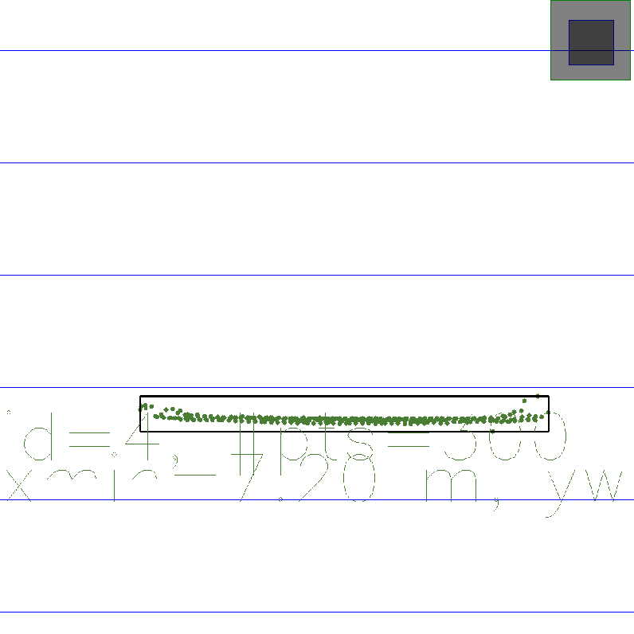
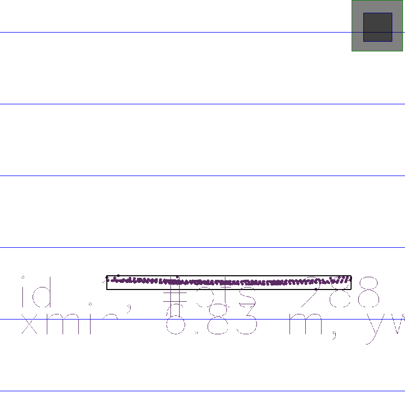
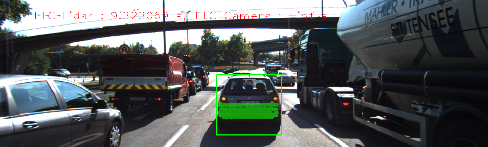
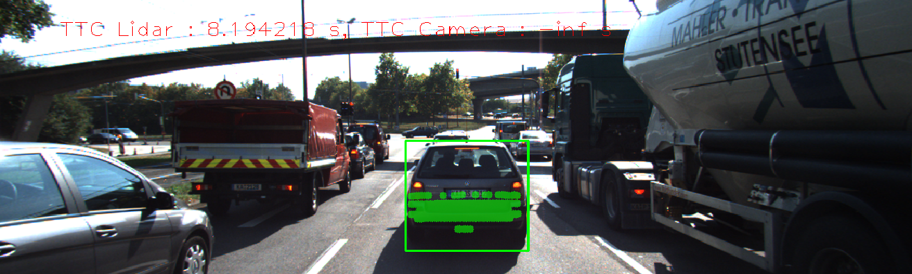

# SFND 3D Feature Tracking Report

## FP.1 Match 3D Objects

The "matchBoundingBoxes", which takes as input both the previous and the current data frames and provides as the output the ids of the matched regions of interest (i.e. the boxID property) is implemented where each bounding box is assigned the match candidate with the highest number of occurences. See function definition for implementation details. 

## FP.2 Copmute Lidar-Based TTC

The time-to-collision (TTC) in seconds for all matched 3D objects using only Lidar measurements from the matched bounding boxes between the current and previous frame is computed. Outliers ar removed using the InterQuartile Range (IQR) algorithm. Points that lie too far from the median of the upper/lower quartiles are not considered when computing TTC.

## FP.3 Assocaite Keypoint Correspondeces with Bounding Boxes

The function "clusterKptMatchesWithROI" prepares the TTC computation based on camera measurements by associating keypoint correspondences to bounding boxes which enclose them. All the matches that sastisfy this condiation are to added to vector in the respective bounding boxes only after outliers have been removed based on the euclidean distance between them in relation to all the matches in the bounding box.

## FP.4 Compute Camera-based TTC

The time-to-collision in seconds for all matched 3D objects using only keypoint correspondences from the matching bounding boxes between the current and previous frame is computed in function "computeTTCCamera." Instead of using the mean to compute TTC, the median is used and is therefore less affected by outliers. 

## FP.5 Performance Evaulation 1

A couple of examples of where the TTC of the Lidar sensor does not seem plausible are determined based on estimating the distance to the rear of the preceding vehicle from a top view perspective of the Lidar points. As the images below show, there are some points that were not picked up in the previous frame that are closer to the ego car than the preceding vehicle actually is. I believe these points are why TTC from the Lidar sensor in these cases are smaller than expected. Lidar TTC estimates are recorded in FP5.csv.

*Lidar Outlier Example 1*

*Lidar Outlier Example 2*

## FP.6 Performance Evaulation 2

All detector/descriptor combinations were implemented and the camera-based TTC estimates are recorded in FP.6.gnumeric. The data and plot of cameras-based TTC are given in the first sheet. Based on the data, it seems like any combinations with ORB as the detector perform the worst. Those have a number of instances where the TTC is -inf and many cases where TTC is very large in the negative direction. With respect to estimating minimum TTC, the best combinations include the following detector/descriptor pairs: Harris/SIFT, Harris/ORB, HARRIS/FREAK. It seems when Harris detector is used the best estimates for TTC are possible. Some examples where the camera-based TTC estimation is way off is shown below.

*Camera Outlier Example 1*

*Camera Outlier Example 2*